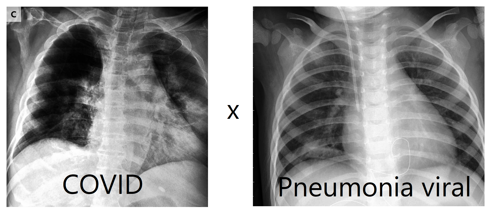
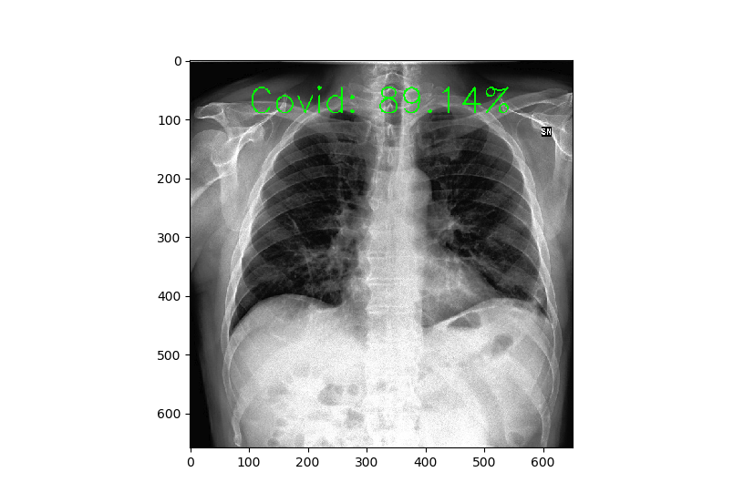
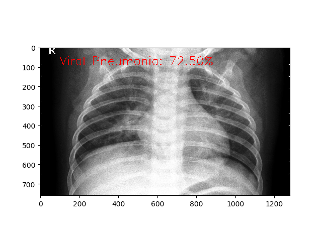

# Covid-and-Pneumonia-Classification-Deep-Learning_TF
Binary classification between x-ray images with covid or pneumonia

Data  : [Click here to download data](https://www.kaggle.com/datasets/pranavraikokte/covid19-image-dataset)

 
 # Classification by NASNetMobile Neural network
 
 ## Validation accuracy: 0.97%

